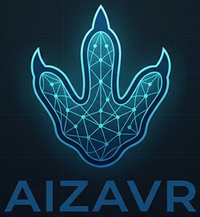

<p align="center">
  
</p>

# AiZavr

> **A workspace for long-form creative and research dialogues with LLMs.**
> Рабочее пространство для длительных творческих и исследовательских диалогов с LLM.

[English](#-aizavr--english) · [Русский](#-aizavr--русский)

---

# 🦕 AiZavr — English

**AiZavr** is not "yet another chat client" but an environment for deep interaction with LLMs. It tackles the structural problems of long dialogues: the linearity of a conversation, context-window overflow, and the lack of orchestration between specialized models.

It is positioned as an **"IDE for creative AI dialogues"** — chat is just one component of the workflow.

> The name comes from "dinosaurs." It's a metaphor for the evolution of a dialogue: many lines of development turn out to be dead ends, and it's better to leave them before you hit the wall. Branching lets you keep what you've built and try alternatives.

## Core ideas

- **A dialogue as a tree, not a list.** Every message is a node; from any model reply you can spawn an alternative branch. All branches are preserved and switching is instant.
- **Markers and compression.** Arbitrary linear ranges of the dialogue are marked and compressed (L0 Hidden / L1 Brief / L2 Summary / L3 Tag) so you don't hit the context window.
- **Context indicator ("traffic light").** A widget shows context-window usage by color and number, counting from the start of the conversation to wherever you've scrolled.
- **Media files and attachments.** Attach images, audio, or documents to a request and send them to multimodal models. Generated or attached files appear in the feed as artifact plaques (media-type icon + explicit extension) and open through your OS file associations. Already-stored media can be re-cited into a new request without copying.
- **Save and export.** Export a linear range of the conversation to **TXT / DOC / HTML / PDF**, with optional embedded images, an LLM model/plugin label per answer, and customizable "question/answer" prefixes for readability.
- **Plugin surface.** LLM providers and tools are widget plugins in the right panel, with a declarative contract and a capability system (API keys never leave the core, file writes go through the core).
- **A zoo of models.** Multiple providers (OpenRouter, Gemini) and a model filter by input/output modalities (text / image / video / audio / other) — the foundation for future orchestration of specialized models.
- **Notebooks and conversations, tags, search.** The left panel organizes the workspace; conversations are tagged (manually and via an LLM plugin) and searchable by tags.

## Screen layout

A classic desktop frame of five zones:

- **Top** — menu bar + address bar (path from the conversation root to the current position).
- **Left** — notebooks and conversations panel.
- **Center** — the active branch, straightened into an ordinary chat.
- **Right** — the plugin widgets panel (context meter, compression, LLM providers, save dialog…).
- **Bottom** — a single multi-line input field (both replies and new branches; attachments are pinned above it as chips).

## Tech stack

| Layer | Technology |
|-------|-----------|
| Shell | [Tauri 2.0](https://tauri.app/) |
| Backend | Rust (`sqlx`, `reqwest`, `keyring`) |
| Frontend | TypeScript + React 19 + Vite |
| Storage | SQLite (via `sqlx`, migrations) |
| PDF export | `pdfmake` (vector text, embedded Cyrillic fonts) |
| Secrets | OS system keychain (`keyring`) |

## Bundled plugins

| Plugin | Purpose |
|--------|---------|
| **OpenRouter** | Access to hundreds of models through a single API. Modality filtering, favorites, auto-reconnect. |
| **Gemini** | Free access to Google Gemini with a key from Google AI Studio. Same filtering and favorites. |
| **Compressor** | LLM-powered compression of a linear dialogue range (between two markers). |
| **Tagger** | LLM-powered conversation tag generation over a marker range. |
| **Save Dialog** | Export a linear marker range to TXT / DOC / HTML / PDF — with optional embedded images, model labels, and custom Q/A prefixes. Fully offline (fonts bundled, no network). |
| **Context Meter** | A "traffic light" for the model's context-window usage. |

## Working with media

- **Sending media to a model.** Attach images, audio, or documents to your request; they are pinned as chips above the input field. Binary media is delivered to the provider as multimodal parts (OpenRouter `image_url` / `input_audio` / `file`, Gemini `inlineData`); text files are inlined. Unsupported types are dropped with a warning, gated by each model's input modalities.
- **Artifacts in the feed.** Generated or attached files live as their own nodes — shown as plaques with a media-type icon and an explicit file extension, opened via your OS (gallery, player, Blender, …).
- **Embedding on export.** The Save Dialog plugin can embed those images straight into the exported document, or fall back to a compact attachment placeholder.

## Getting started

### Prerequisites

- [Node.js](https://nodejs.org/) 18+ and npm
- [Rust](https://www.rust-lang.org/tools/install) (stable toolchain)
- Tauri system dependencies for your OS — see [tauri.app/start/prerequisites](https://tauri.app/start/prerequisites/)

### Install

```bash
git clone https://github.com/MrLUG67/AiZavr.git
cd AiZavr
npm install
```

### Run in development

```bash
# Full desktop app (Tauri + frontend):
npm run tauri dev

# Frontend only, in the browser (no Tauri backend):
npm run dev
```

### Build a release

```bash
npm run tauri build
```

Installers are produced in `src-tauri/target/release/`.

### Type-check

```bash
npm run build   # tsc && vite build
```

## Project structure

```
AiZavr/
├─ src/                      # Frontend (React + TypeScript)
│  ├─ dialog/                # Dialogue tree controller and view
│  ├─ widgets/               # Widget plugins and host
│  │  ├─ host/               # Plugin contract, control renderer, forms, capabilities
│  │  ├─ llm/                # Shared LLM provider logic (registry, capabilities, media)
│  │  ├─ openrouter/         # OpenRouter provider plugin
│  │  ├─ gemini/             # Google Gemini provider plugin
│  │  ├─ compressor/         # Marker-range compression plugin
│  │  ├─ tagger/             # LLM tagging plugin
│  │  ├─ save-dialog/        # Export a marker range to TXT/DOC/HTML/PDF
│  │  └─ context-meter/      # Context "traffic light" widget
│  └─ i18n/                  # Localization
├─ src-tauri/                # Backend (Rust)
│  └─ src/
│     ├─ config/             # File-based plugin configs (cap.config)
│     ├─ artifacts/          # Attachments and artifact storage
│     └─ ...                 # DB, markers, tree, export commands
└─ docs/                     # Concept, specification, design notes
```

## Configuration and API keys

- **API keys** are entered in each LLM plugin's settings (gear ⚙ → "API Key" tab) and stored in the **OS system keychain** — they never land in project files and never leave the core.
- **Plugin settings** (selected model, favorites, prompts) are stored in human-readable files at `app_data_dir/config/<plugin_id>.json`.
- **Dialogues and attachments** are stored in a local SQLite database and the app's data directory.

Where to get keys:
- OpenRouter — [openrouter.ai/keys](https://openrouter.ai/keys)
- Gemini — [aistudio.google.com/apikey](https://aistudio.google.com/apikey) (free)

## Status

The project is under active early development. Done: branching dialogue tree, markers and topology, a resilient send flow, the widget host and plugins, OpenRouter/Gemini providers, media attachments to models, artifact plaques, conversation export to TXT/DOC/HTML/PDF, tags and search, file-based plugin configs and modal settings forms. Planned: compression (implementation), artifact-generation orchestration, notebooks and knowledge cards, direct provider keys, and local models.

## Author and license

- Author: **Yurii** ([@MrLUG67](https://github.com/MrLUG67))
- Repository: [github.com/MrLUG67/AiZavr](https://github.com/MrLUG67/AiZavr)
- License: open source (intended **MIT** / **Apache-2.0**).

---

# 🦕 AiZavr — Русский

**AiZavr** — это не «ещё один чат-клиент», а среда для глубокого общения с ИИ. Она решает структурные проблемы длинных диалогов: линейность переписки, переполнение контекстного окна и отсутствие оркестрации специализированных моделей.

Позиционирование — **«IDE для творческих диалогов с ИИ»**: чат здесь лишь один из компонентов рабочего процесса.

> Название — от «динозавров». Метафора эволюции диалога: многие линии развития оказываются тупиковыми, и от них стоит уйти раньше, чем дойдёшь до тупика. Ветвление позволяет не терять наработанное и пробовать альтернативы.

## Ключевые идеи

- **Диалог как дерево, а не список.** Каждое сообщение — узел; от любого ответа модели можно создать альтернативную ветку. Все ветки сохраняются, переключение мгновенно.
- **Маркеры и сжатие.** Произвольные линейные диапазоны диалога помечаются маркерами и сжимаются (L0 Hidden / L1 Brief / L2 Summary / L3 Tag), чтобы не упираться в контекстное окно.
- **Индикатор контекста («светофор»).** Виджет показывает заполнение окна модели цветом и числом; считает объём от начала беседы до места, до которого вы доскроллили.
- **Медиафайлы и вложения.** К запросу можно прикрепить изображения, аудио или документы и отправить их мультимодальным моделям. Сгенерированные или прикреплённые файлы появляются в ленте плашками (иконка типа медиа + явное расширение) и открываются через ассоциации ОС. Уже хранящееся медиа можно «процитировать» в новый запрос без копирования.
- **Сохранение и экспорт.** Линейный фрагмент беседы экспортируется в **TXT / DOC / HTML / PDF** с опциональным встраиванием изображений, меткой модели/плагина у каждого ответа и настраиваемыми префиксами «вопрос/ответ» для читаемости.
- **Плагинная поверхность.** Провайдеры LLM и инструменты — это плагины-виджеты в правой панели, с декларативным контрактом и системой капабилити (ключи API не покидают ядро, запись файлов идёт через ядро).
- **Зоопарк моделей.** Несколько провайдеров (OpenRouter, Gemini) и фильтр моделей по модальностям вход/выход (текст / изображение / видео / аудио / прочее) — основа будущей оркестрации специализированных моделей.
- **Блокноты и беседы, теги, поиск.** Левая панель организует рабочее пространство; беседы тегируются (вручную и через LLM-плагин) и ищутся по тегам.

## Карта экрана

Классическая десктопная рамка из пяти зон:

- **Верх** — строка меню + адресная строка (путь от корня беседы до текущей позиции).
- **Лево** — панель блокнотов и бесед.
- **Центр** — активная ветка, выпрямленная как обычный чат.
- **Право** — панель виджетов-плагинов (индикатор контекста, сжатие, провайдеры LLM, сохранение диалога…).
- **Низ** — единое многострочное поле ввода (и реплики, и новые ветки; вложения закрепляются над ним чипами).

## Технологический стек

| Слой | Технология |
|------|-----------|
| Оболочка | [Tauri 2.0](https://tauri.app/) |
| Бэкенд | Rust (`sqlx`, `reqwest`, `keyring`) |
| Фронтенд | TypeScript + React 19 + Vite |
| Хранилище | SQLite (через `sqlx`, миграции) |
| Экспорт в PDF | `pdfmake` (векторный текст, кириллические шрифты в комплекте) |
| Секреты | Системный keychain ОС (`keyring`) |

## Плагины в комплекте

| Плагин | Назначение |
|--------|-----------|
| **OpenRouter** | Доступ к сотням моделей через единый API. Фильтр моделей по модальностям, избранное, авто-переподключение. |
| **Gemini** | Бесплатный доступ к Google Gemini по ключу из Google AI Studio. Те же возможности фильтрации и избранного. |
| **Compressor** | Сжатие линейного диапазона диалога (между двумя маркерами) силами LLM. |
| **Tagger** | Генерация тегов беседы силами LLM по диапазону маркеров. |
| **Save Dialog** | Экспорт линейного диапазона маркеров в TXT / DOC / HTML / PDF — с опциональным встраиванием изображений, меткой модели и настраиваемыми префиксами вопроса/ответа. Полностью офлайн (шрифты в комплекте, без сети). |
| **Context Meter** | «Светофор» заполнения контекстного окна модели. |

## Работа с медиафайлами

- **Отправка медиа модели.** К запросу прикрепляются изображения, аудио или документы — они закрепляются чипами над полем ввода. Бинарное медиа уходит провайдеру мультимодальными частями (OpenRouter `image_url` / `input_audio` / `file`, Gemini `inlineData`); текстовые файлы встраиваются в текст. Неподдерживаемые типы отбрасываются с предупреждением, с проверкой по входным модальностям модели.
- **Артефакты в ленте.** Сгенерированные или прикреплённые файлы живут отдельными узлами — показываются плашками с иконкой типа медиа и явным расширением, открываются через ОС (галерея, плеер, Blender, …).
- **Встраивание при экспорте.** Плагин «Save Dialog» может вшить эти изображения прямо в итоговый документ либо оставить компактную пометку о вложении.

## Начало работы

### Предварительные требования

- [Node.js](https://nodejs.org/) 18+ и npm
- [Rust](https://www.rust-lang.org/tools/install) (стабильный toolchain)
- Системные зависимости Tauri для вашей ОС — см. [tauri.app/start/prerequisites](https://tauri.app/start/prerequisites/)

### Установка

```bash
git clone https://github.com/MrLUG67/AiZavr.git
cd AiZavr
npm install
```

### Запуск в режиме разработки

```bash
# Полноценное десктоп-приложение (Tauri + фронтенд):
npm run tauri dev

# Только фронтенд в браузере (без бэкенда Tauri):
npm run dev
```

### Сборка релиза

```bash
npm run tauri build
```

Готовые инсталляторы появятся в `src-tauri/target/release/`.

### Проверка типов

```bash
npm run build   # tsc && vite build
```

## Структура проекта

```
AiZavr/
├─ src/                      # Фронтенд (React + TypeScript)
│  ├─ dialog/                # Контроллер и представление дерева диалога
│  ├─ widgets/               # Плагины-виджеты и хост
│  │  ├─ host/               # Контракт плагина, рендерер контролов, формы, капабилити
│  │  ├─ llm/                # Общая логика провайдеров LLM (реестр, capabilities, медиа)
│  │  ├─ openrouter/         # Плагин-провайдер OpenRouter
│  │  ├─ gemini/             # Плагин-провайдер Google Gemini
│  │  ├─ compressor/         # Плагин сжатия диапазона маркеров
│  │  ├─ tagger/             # Плагин LLM-тегирования
│  │  ├─ save-dialog/        # Экспорт диапазона маркеров в TXT/DOC/HTML/PDF
│  │  └─ context-meter/      # Виджет «светофор» контекста
│  └─ i18n/                  # Локализация
├─ src-tauri/                # Бэкенд (Rust)
│  └─ src/
│     ├─ config/             # Конфиги плагинов в файлах (cap.config)
│     ├─ artifacts/          # Хранение вложений и артефактов
│     └─ ...                 # БД, маркеры, дерево, команды экспорта
└─ docs/                     # Концепция, спецификация, заметки по дизайну
```

## Настройка и ключи API

- **API-ключи** вводятся в окне настроек каждого LLM-плагина (шестерёнка ⚙ → вкладка «API Key») и хранятся в **системном keychain ОС** — они не попадают в файлы проекта и не покидают ядро.
- **Настройки плагинов** (выбранная модель, избранное, промпты) хранятся в человекочитаемых файлах `app_data_dir/config/<plugin_id>.json`.
- **Диалоги и вложения** хранятся в локальной базе SQLite и каталоге данных приложения.

Где взять ключи:
- OpenRouter — [openrouter.ai/keys](https://openrouter.ai/keys)
- Gemini — [aistudio.google.com/apikey](https://aistudio.google.com/apikey) (бесплатно)

## Статус

Проект в активной ранней разработке. Готово: дерево диалога с ветвлением, маркеры и топология, устойчивый поток отправки, виджет-хост и плагины, провайдеры OpenRouter/Gemini, отправка медиа моделям, плашки артефактов, экспорт беседы в TXT/DOC/HTML/PDF, теги и поиск, файловые конфиги плагинов и модальные формы настроек. В планах: сжатие (код), оркестрация генерации артефактов, блокноты и карточки знаний, прямые ключи провайдеров и локальные модели.

## Автор и лицензия

- Автор: **Юрий** ([@MrLUG67](https://github.com/MrLUG67))
- Репозиторий: [github.com/MrLUG67/AiZavr](https://github.com/MrLUG67/AiZavr)
- Лицензия: открытый исходный код (предполагается **MIT** / **Apache-2.0**).
